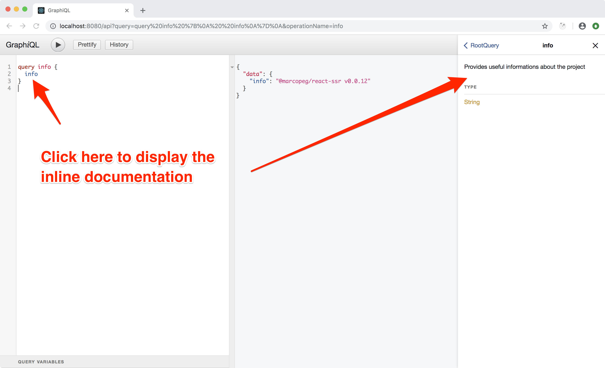

# GraphQL - Setup

The first place where to deal with GraphQL is in the backend of our app.

In the [server side rendering tutorial](./ssr.md) you set up a simple ExpressJS
server that is capable of rendering our React app.

Now you are going to extend this server and create a **fully working GraphQL endpoint**.

## NPM Dependencies

GraphQL comes as two _NPM libraries_ that are going to handle all the heavy lifting for us:

    npm install --save \
        graphql \
        express-graphql

## Api Route

GraphQL works by posting requests to a single endpoint. In my apps I often use the
generic endpoint `/api`, and you are going to do the same in this tutorial. But mind
that this is just the way I use to do... you can set this as you want!

Edit `/ssr/boot.js` and import the GraphQL middleware 
(that we are going to create):

    import { graphQLHandler } from './graphql'

then apply the middleware on `/api` just before `app.use(createSSRRouter())`:

    app.use('/api', graphQLHandler)

## GraphQL Schema

Create `/ssr/graphql/index.js`:

    import { GraphQLSchema, GraphQLObjectType } from 'graphql'
    import expressGraphql from 'express-graphql'

    // manifest of the available queries
    const queries = {
        info: require('./info.query').default,
    }

    // manifest of the available mutation
    // const mutations = {}

    // package the GraphQL schema for the app
    const schema = new GraphQLSchema({
        query: new GraphQLObjectType({
            name: 'RootQuery',
            fields: queries,
        }),
        // mutation: new GraphQLObjectType({
        //     name: 'RootMutation',
        //     fields: mutations,
        // }),
    })

    // ExpressJS middleware that mount GraphQL
    export const graphQLHandler = (req, res) => expressGraphql({
        schema,
        graphiql: process.env.NODE_ENV === 'development',
        context: { req, res, data: {} },
    })(req, res)

There are a few things to note down about this file.

**Thing n.1:** we declare `queries` and `mutations` as objects and we require some
files into them. You can immagine those files as the **capabilities of our api**.

> A **query** allow you to read data, a **mutation** allow you to change data.
> Those are simple GraphQL conventions and you should honor them so to explicitly
> declare ground level intentions when you expose or consume an API.

_(I have commented out the "mutation" section as we don't have any yet.)_

**Thing n.2:** the property `graphiql` enable a **developer console** that you can
access through your browser and use to test and explore your API. It's a fundamental
tool for development, but you should care to disable it in production.

**Thing n.3:** the property `context` is used to provide some shared memory to any
API endpoint. As you can see I use it to forward the `req` and `res` object, as well
an empty `data` object that comes really in handy when handling authentication in
nested queries (but that's kinda advanced and we are not going to use it yet).

## Your first query

Create `/ssr/graphql/info.query`:

    import { GraphQLString } from 'graphql'
    import ssr from '@marcopeg/react-ssr/package.json'

    export default {
        description: 'Provides info regarding the react-ssr version',
        type: GraphQLString,
        resolve: () => `${ssr.name} v${ssr.version}`,
    }

This file implemens a fully woring GraphQL endpoint. Simple, right?

In the previous step we "mounted" this query on the `info` endpoint. Now we declare
this endpoint of **type string** and it outputs... a string.

# Run it!

Now I will introduce you to a new NPM script:

    npm run start:dev:api

This will start your backend (basically `/ssr/boot.js`) in _development_ mode and run it
through [nodemon](https://nodemon.io/) so to automatically restart it when you change any
source file. It will also apply Babel on the fly, so you don't have to build your project in advance.

Open your browser to:

    http://localhost:8080/api

What you see is called [graphiql](https://github.com/graphql/graphiql) ans it's the
development tool where you can test your GraphQL API.

**NOTE:** GraphQL is nothing more than a **typed REST interface**.  
You can use it through `curl` (if you are inclined to do so):

    curl 'http://localhost:8080/api?' -H 'Content-Type: application/json' -H 'Connection: keep-alive' --data-binary '{"query":"query getInfo { info }","variables":null,"operationName":"getInfo"}'

