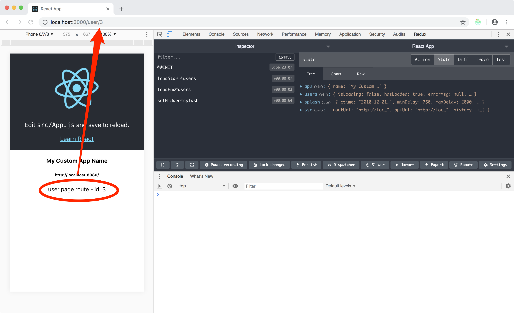

# React Router - Add some routes

The next step consist in creating at least 2 pages in our app. The home page
already contains a list of names and it's our page n.1, we are going to link
each name to it's own personal page where we will show some more data.

Before you move forward I suggest you open `/src/App.css` and edit the height
of the default `create-react-app` header:

change:

    .App-header {
        min-height: 100vh;

to:

    .App-header {
        min-height: 270px;

This small change will make it more comfortable to read the people's list and the
details page.

### User details page

Now create a dummy UserPage container (we will work more on it later) 
in `/src/features/users/UserPage.container.js`:

    import React from 'react'

    const UserPage = ({ match }) => (
        
user page route - id: {match.params.id}

    )

    export default UserPage

and remeber to export it from the [feature's manifest](./features.md)
`/src/features/users/index.js`:

    export const UserPage = loadable({
        loader: () => import(/* webpackChunkName: "UserPage" */'./UserPage.container'),
        loading: () => 'loading...'
    })

### Declare your routes

Open `/src/App.js` and compose your app's main routes declaration. Consider that `react-router`
is very flexible and allows you do deep nest routes. _You don't have to write them all here!_

    import { Switch, Route } from 'react-router-dom'
    import { Users, UserPage } from './features/users'

    ...

    <Switch>
        <Route exact path="/" component={Users} />
        <Route path="/user/:id" component={UserPage} />
    </Switch>

### Link the user's pages

The very last step would be to use a `Link` component and transform your list of users
into a list of link in `/src/features/users/Users.container.js`:

    import { Link } from 'react-router-dom'

    ...

    render () {

        ...

        return (
            <ul style={styles.list}>
                {this.props.list.map(user => (
                    <li key={`user-${user.id}`}>
                        <Link to={`/user/${user.id}`}>
                            {user.name}
                        </Link>
                    </li>
                ))}
            </ul>
        )
    }

## Run and test!

I strongly suggest you try to run your app in development mode first:

    npm start

This will only execute Webpack and the default `create-react-app` pipeline.
The expected result is a splash screen that disappear almost right away
followed by your home page that consist now in a list of links.

Clicking any of the links you should be able to access the dummy user details page
as shown in the following screenshots:

If this works without troubles you can test the production version where the 
server side rendering takes effect:

    npm run start:prod

> Remember that this may take a while to spin up as there are a few building steps that
> your machine need to go through!

The end result should be alike what you have seen in development, but without the splash screen
as all the heavy lifting was performed in the backend!

This is not much for now, but the routing is in place and up for the job.

In the next chapter we are going to fetch more data and render a rich details page for each user.

