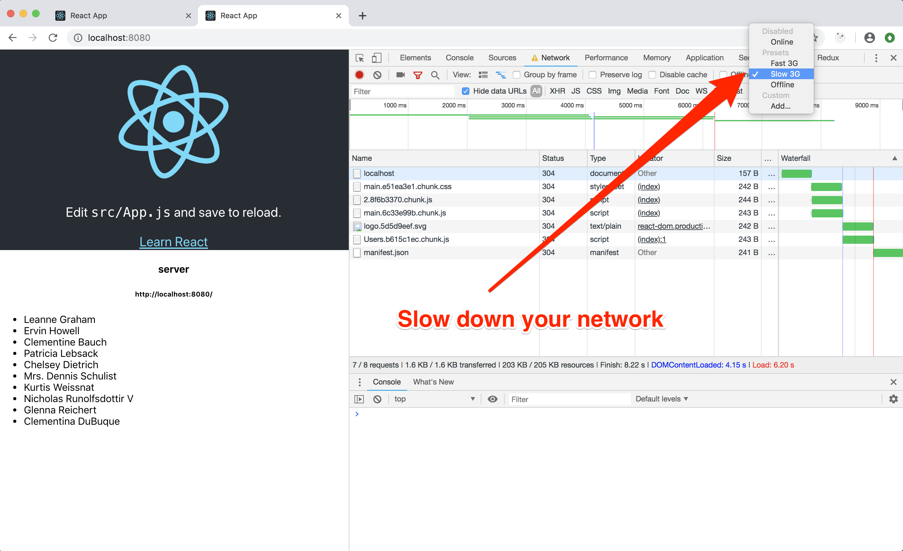

# SSR - Code Splitting

I promise this is the last step :-)

You might have noticed that the SSR works correctly on the server, but we still have
an **annoying flickering** on the client.

The page loads with all her data, but then the list get cleaned out, a "loading" appears,
and in a blicnk of an eye the list is back in. Horrible!

> **NOTE:** to make this problem even worse try to slow down your network using
> the Chrome Network dev tool panel (or just try to work from Italy!)
>
> 

## The Solution:

Open `/webpack.config.extend.js` and add the `webpackReactLoadable` plugin:

    const { webpackReactLoadable } = require('@marcopeg/react-ssr/lib/webpack-react-loadable')
    module.exports = config => webpackReactLoadable(config)

## The Problem:

Do you remember that we used `react-loadable` in `/src/features/users/index.js` so to
make the whole Users' feature UI build into a separated bundle?

This is a common way of **improving load time in your app** as the end user will download
only a portion of your entire app that interest the specific route she's asking
(more about routing later on).

Every time you use `react-loadable` to require a module Webpack creates a new `chunk`
ending up in a **separated javascript file** that your app need to download. The 
cool thing about loadable is that while the user is waiting for the chunk to come, 
you can provide an alternate component... like a "loading..." message.

During SSR there are no problems, all gets correctly loaded and the resulting HTML is
correctly spit out.

> If you had no Javascript on the client you wouldn't notice any
> flickering!

**The real problem** is that the client boots with only the Javascript entry point. Then
it finds out that another piece is required and begins to download, but in the meanwhile
**it will render the fancy "loading..." message over our server side rendered list** of
people!

This annoying thing will last as long as it takes to download the file, often a very
short time, still enough to annoy me very much.

### The Solution Explained:

By extending the [webpack configuration](https://webpack.js.org/configuration/) with
the `webpackReactLoadable` plugin we produce a map of which component was written in
which chunk.

> You can open this map from `/build/react-loadable.json`.

During SSR we also keep track of every component that has been involved in the rendering
process, and check out the relative chunk from the map.

With those informations it's a simple step to simply inject those `<script>` tags in the
resulting HTML source, so that all the code that is needed to generate the first paint
will be in place right away without further HTTP requests.
