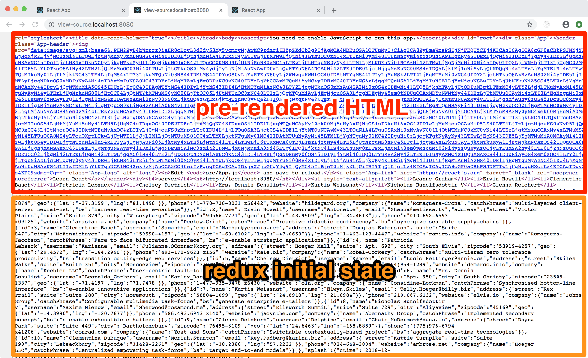

# SSR - Kickoff!

You have now reached the end of this first step-by-step tutorial and are so so
close to run the SSR app!

### Step n.1 - Create the entry points:

Create `/index.js` (production)

    'use strict';

    require('@babel/polyfill');

    require('./build-ssr/boot').default().catch(function (err) {
        console.log('*** BOOT: Fatal Error');
        console.log(err);
    });

Create  `/index.dev.js` (development)

    require('@babel/polyfill')
    require('@babel/register')

    require('./ssr/boot').default().catch((err) => {
        console.log('*** BOOT: Fatal Error')
        console.log(err)
    })

### Step n.2 - Run the app!

    npm run start:prod

This simple script should do all the magic for you. It might take a while to execute
because it will first transpile your sources and build the Webpack's bundles, but then
it should spin up the server and your app should be available at:

    http://localhost:8080

If everything goes according to plan you should be able to see the fully working app
and **it's server side generated source code** similar to the screenshot below:

## About transpiling...

The cool thing here is that the `index.dev.js` uses a particular technique that allows
Babel to hook into the `require()` function and perform a one time transpiling pass
while our app is booting up.

Of course this is cool and handy during development, but is not very efficient and
may also lead to some safety problems, so I won't suggest you run this in production.

When it comes to production, we need to transpile before hand so that Node will
run a static codebase (no live transpiling in prod!)

Is that difficult? No!

Bear with me one more minute and you will see how easy is to put all of this
toghether using the super powers of `package.json` scripts.