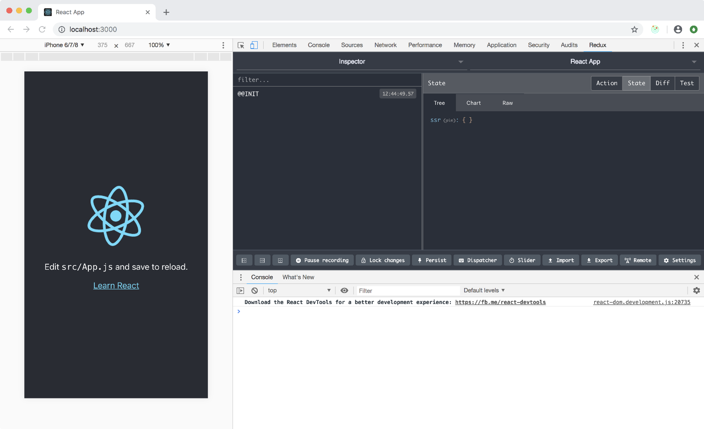

# Add Redux

[Redux](https://redux.js.org/) is an important component of any server side rendered
application as it allow us to progressively compose a state while resolving asynchronous
calls such apis, code splitting, ect.

`@marcopeg/react-ssr` ships some helper functions that facilitate the setup.

### Step n.1

Create an `src/state.js` file in your app:

    import createSSRState from '@marcopeg/react-ssr/lib/create-ssr-state'
    export const createState = createSSRState()

**NOTE:** further on we are going to add some juice to this file by setting up
our app's core reducers and features.

### Step n.2

Create an `src/Root.js` file in your app:

    import React from 'react'
    import { Provider } from 'react-redux'
    import App from './App'

    const Root = ({ store, ...props }) => (
        <Provider store={store}>
            <App {...props} />
        </Provider>
    )

    export default Root

**NOTE:** this components is used to wire up your application, right now it implements
the Redux' provider, but later on we will enrich it with the 
[react-router](https://reacttraining.com/react-router/) provider as well.

This leaves the `src/App.js` to the real app's business logic, clean from infrastructural
nightmares :-)

### Step n.3

Implement the redux state in your app's entry point `src/index.js`:

    import React from 'react'
    import ReactDOM from 'react-dom'
    import './index.css'
    import * as serviceWorker from './serviceWorker'
    import { createState } from './state'
        
    const boot = props => {
        const renderApp = () => {
            const Root = require('./Root').default
            ReactDOM.render(<Root {...props} />, document.querySelector('#root'))
        }

        if (module.hot) {
            module.hot.accept(renderApp)
        }

        renderApp()
    }

    createState()
        .then(boot)

        // If you want your app to work offline and load faster, you can change
        // unregister() to register() below. Note this comes with some pitfalls.
        // Learn more about service workers: http://bit.ly/CRA-PWA
        // serviceWorker.unregister();
        .then(() => serviceWorker.unregister())

        .catch(err => console.log(err))

### Hot Module Reload

The proposed setup enables **Hot Module Reload** in your CRA.

It is worth to mention that this is a very basic implementation and will not preserve
the state of single components upon reload.

On the other hand, it preserves the redux state, so it will be a very nice experience
to work out your application anyway. You might still need to do full reloads here and
there when you change reducers or functions that are attached to DOM events.

Again, this is a very simple implementation that works nicely for most of the
development challenges that I've been facing so far.

If you want more you should consider to [work with a styleguide](../articles/styleguide.md).

### Check it out!

Just `npm start` the app and check out that the [redux-devtools](https://chrome.google.com/webstore/detail/redux-devtools/lmhkpmbekcpmknklioeibfkpmmfibljd?hl=en) are working properly. Don't worry, they are going to be removed in production!

### What do I get with Redux?

Here is the list of libraries that are going to be wired up for your convenience:

- [redux (state management)](https://redux.js.org/)
- [redux thunk](https://www.npmjs.com/package/redux-thunk)
- [redux events](https://www.npmjs.com/package/redux-events-middleware)
- [redux features](https://www.npmjs.com/package/react-redux-feature)
